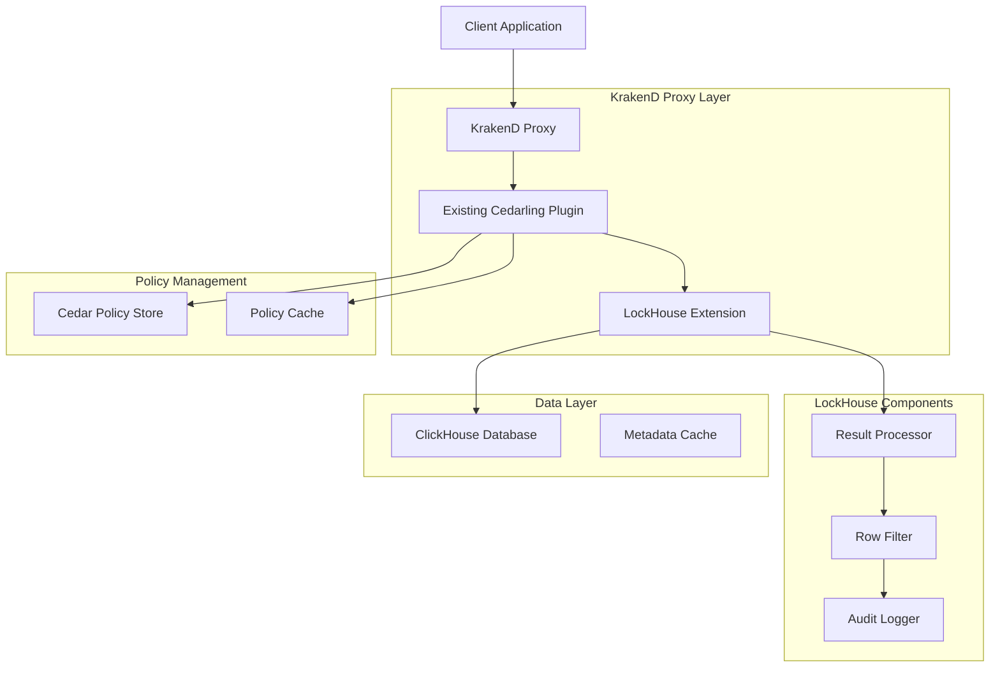

# Design Document

## Overview

The LockHouse system implements document-level security for ClickHouse databases by extending the existing Cedarling KrakenD plugin with ClickHouse-specific result filtering capabilities. The solution leverages the existing Krakend Cedarling plugin for JWT validation and policy evaluation for the ClickHouse REST endpoint, while adding a specialized component that filters ClickHouse query results based on Cedar policy decisions.

The architecture uses the existing Cedarling KrakenD plugin to handle authentication and policy evaluation, then passes the user context and query results to LockHouse for row-level filtering. When a client submits a query, the Cedarling plugin validates the JWT token and extracts user context. LockHouse then executes the query against ClickHouse unchanged, receives the complete result set, and evaluates each row against Cedar policies using the user context provided by Cedarling. Only rows that pass policy evaluation are included in the final response.

This approach leverages the existing Cedarling infrastructure while adding ClickHouse-specific result filtering logic, ensuring users can only access data they are authorized to view without duplicating authentication or policy evaluation functionality.

## Use Case Scope and Limitations

**LockHouse is optimized for read-only, document-level security use cases with bounded result sizes.** This solution is **not intended for analytics workloads** that process large datasets or require high-throughput aggregations.

### Ideal Use Cases
- **Document retrieval**: User profiles, customer records, support tickets
- **Bounded result sets**: Queries returning hundreds to low thousands of rows
- **Row-level security**: Access control based on user attributes and document properties
- **Real-time applications**: Interactive dashboards, user-facing applications
- **Compliance scenarios**: GDPR, HIPAA, or other data privacy requirements

### Not Suitable For
- **Analytics workloads**: Large-scale data processing, reporting, or business intelligence
- **Unbounded queries**: Full table scans or queries returning millions of rows
- **High-throughput scenarios**: Batch processing or ETL operations
- **Aggregation-heavy workloads**: Complex analytical queries with GROUP BY, window functions

### Performance Characteristics
- **Memory usage**: Constant memory through streaming result processing
- **Latency**: Optimized for sub-100ms response times on bounded result sets
- **Throughput**: Designed for concurrent user queries, not bulk data processing
- **Scalability**: Horizontal scaling through multiple proxy instances

## Example Walkthrough

### Sample ClickHouse Data

**employees table:**
```sql
CREATE TABLE employees (
    id UInt32,
    name String,
    department String,
    salary UInt32,
    manager_id Nullable(UInt32),
    security_level String
) ENGINE = MergeTree() ORDER BY id;

INSERT INTO employees VALUES
(1, 'Alice Johnson', 'Engineering', 95000, NULL, 'public'),
(2, 'Bob Smith', 'Engineering', 85000, 1, 'internal'),
(3, 'Carol Davis', 'HR', 75000, NULL, 'confidential'),
(4, 'David Wilson', 'Finance', 90000, NULL, 'restricted'),
(5, 'Eve Brown', 'Engineering', 80000, 1, 'internal');
```

**projects table:**
```sql
CREATE TABLE projects (
    id UInt32,
    name String,
    department String,
    budget UInt32,
    classification String,
    owner_id UInt32
) ENGINE = MergeTree() ORDER BY id;

INSERT INTO projects VALUES
(1, 'Web Platform', 'Engineering', 500000, 'internal', 1),
(2, 'Mobile App', 'Engineering', 300000, 'public', 2),
(3, 'HR System', 'HR', 200000, 'confidential', 3),
(4, 'Financial Analytics', 'Finance', 400000, 'restricted', 4),
(5, 'API Gateway', 'Engineering', 250000, 'internal', 5);
```

### Sample Cedar Policies

```cedar
// Policy 1: Users can view employees in their own department
permit (
  principal,
  action == ClickHouseLock::Action::"Select",
  resource
) when {
  resource.table == "employees" &&
  resource.department == principal.department
};

// Policy 2: Managers can view all employees they manage
permit (
  principal,
  action == ClickHouseLock::Action::"Select",
  resource
) when {
  resource.table == "employees" &&
  resource.manager_id == principal.id
};

// Policy 3: Users can only view data at or below their security clearance
permit (
  principal,
  action == ClickHouseLock::Action::"Select",
  resource
) when {
  resource.table == "employees" &&
  (
    (principal.security_clearance == "restricted") ||
    (principal.security_clearance == "confidential" && resource.security_level in ["public", "internal", "confidential"]) ||
    (principal.security_clearance == "internal" && resource.security_level in ["public", "internal"]) ||
    (principal.security_clearance == "public" && resource.security_level == "public")
  )
};

// Policy 4: Project access based on department and classification
permit (
  principal,
  action == ClickHouseLock::Action::"Select",
  resource
) when {
  resource.table == "projects" &&
  resource.department == principal.department &&
  (
    (principal.security_clearance == "restricted") ||
    (principal.security_clearance == "confidential" && resource.classification in ["public", "internal", "confidential"]) ||
    (principal.security_clearance == "internal" && resource.classification in ["public", "internal"]) ||
    (principal.security_clearance == "public" && resource.classification == "public")
  )
};
```

### Example Filtering Scenarios

#### Scenario 1: Engineering Manager Query
**User Context:**
```json
{
  "sub": "alice@company.com",
  "id": 1,
  "department": "Engineering",
  "security_clearance": "internal",
  "role": "manager"
}
```

**Query:** `SELECT * FROM employees;`

**ClickHouse Raw Results:**
```
id | name         | department  | salary | manager_id | security_level
1  | Alice Johnson| Engineering | 95000  | NULL       | public
2  | Bob Smith    | Engineering | 85000  | 1          | internal  
3  | Carol Davis  | HR          | 75000  | NULL       | confidential
4  | David Wilson | Finance     | 90000  | NULL       | restricted
5  | Eve Brown    | Engineering | 80000  | 1          | internal
```

**Policy Evaluation per Row:**
- Row 1 (Alice): ✅ Same department + public security level
- Row 2 (Bob): ✅ Same department + internal security level + Alice is manager
- Row 3 (Carol): ❌ Different department (HR)
- Row 4 (David): ❌ Different department (Finance)  
- Row 5 (Eve): ✅ Same department + internal security level + Alice is manager

**Filtered Results:**
```
id | name         | department  | salary | manager_id | security_level
1  | Alice Johnson| Engineering | 95000  | NULL       | public
2  | Bob Smith    | Engineering | 85000  | 1          | internal
5  | Eve Brown    | Engineering | 80000  | 1          | internal
```

#### Scenario 2: HR Employee Query
**User Context:**
```json
{
  "sub": "carol@company.com", 
  "id": 3,
  "department": "HR",
  "security_clearance": "confidential",
  "role": "employee"
}
```

**Query:** `SELECT * FROM projects;`

**ClickHouse Raw Results:**
```
id | name              | department  | budget | classification | owner_id
1  | Web Platform      | Engineering | 500000 | internal       | 1
2  | Mobile App        | Engineering | 300000 | public         | 2  
3  | HR System         | HR          | 200000 | confidential   | 3
4  | Financial Analytics| Finance     | 400000 | restricted     | 4
5  | API Gateway       | Engineering | 250000 | internal       | 5
```

**Policy Evaluation per Row:**
- Row 1 (Web Platform): ❌ Different department (Engineering)
- Row 2 (Mobile App): ❌ Different department (Engineering)
- Row 3 (HR System): ✅ Same department + confidential clearance allows confidential data
- Row 4 (Financial Analytics): ❌ Different department (Finance)
- Row 5 (API Gateway): ❌ Different department (Engineering)

**Filtered Results:**
```
id | name      | department | budget | classification | owner_id
3  | HR System | HR         | 200000 | confidential   | 3
```

#### Scenario 3: Public Access User Query
**User Context:**
```json
{
  "sub": "guest@company.com",
  "id": null,
  "department": "External",
  "security_clearance": "public",
  "role": "guest"
}
```

**Query:** `SELECT name, department FROM employees;`

**ClickHouse Raw Results:**
```
name         | department
Alice Johnson| Engineering
Bob Smith    | Engineering  
Carol Davis  | HR
David Wilson | Finance
Eve Brown    | Engineering
```

**Policy Evaluation per Row:**
- Row 1 (Alice): ❌ Different department + only public clearance but Alice is public level
- Row 2 (Bob): ❌ Different department + internal level exceeds public clearance
- Row 3 (Carol): ❌ Different department + confidential level exceeds public clearance
- Row 4 (David): ❌ Different department + restricted level exceeds public clearance
- Row 5 (Eve): ❌ Different department + internal level exceeds public clearance

**Filtered Results:**
```
(No rows returned - guest user has no access to employee data)
```

### Policy Evaluation Process

For each result row, the system:

1. **Builds Row Context**: Extracts row data into Cedar resource entity
```json
{
  "table": "employees",
  "id": "2", 
  "department": "Engineering",
  "security_level": "internal",
  "manager_id": "1"
}
```

2. **Evaluates Policies**: Tests each applicable policy against user context and row data
3. **Makes Decision**: Row is included only if at least one policy permits access
4. **Logs Decision**: Records policy evaluation results for audit

This approach provides fine-grained, policy-driven access control while maintaining query performance and Cedar policy expressiveness.

## Architecture

### High-Level Architecture



### Component Interaction Flow

**LockHouse implements a two-stage authorization process:**

**Stage 1: Request Authorization**
1. **Request Reception**: KrakenD receives SQL query with JWT authentication
2. **JWT Validation**: Existing Cedarling plugin validates JWT tokens and extracts user context
3. **Request Authorization**: Cedarling evaluates Cedar policies to determine if the user is authorized to make this type of request to this REST endpoint
4. **Authorization Gate**: If request authorization fails, the request is denied immediately without executing the query

**Stage 2: Data-Level Authorization**
5. **Query Execution**: LockHouse executes original query against ClickHouse without modification
6. **Streaming Result Processing**: Results are processed in streaming fashion with constant memory usage
7. **Batch Policy Evaluation**: Multiple rows are batched together for efficient policy evaluation against Cedar policies
8. **Per-Principal Caching**: Policy decisions are cached per user to optimize repeated patterns
9. **Result Filtering**: Rows that fail data-level policy evaluation are removed from the stream
10. **Response Assembly**: Filtered results are streamed back through Cedarling plugin
11. **Audit Logging**: Both request authorization and data filtering decisions are logged asynchronously

This dual authorization approach ensures that:
- **Request-level security**: Users can only access endpoints they're authorized for based on JWT claims and REST endpoint policies
- **Data-level security**: Users only see specific data rows they're authorized to view based on document attributes and user context

## Components and Interfaces

### LockHouse Extension

**Purpose**: ClickHouse-specific extension that integrates with the existing Cedarling KrakenD plugin to provide result filtering capabilities.

**Key Responsibilities**:
- ClickHouse query execution and result processing
- Row-level policy evaluation using Cedarling's policy engine
- Result filtering based on Cedar policy decisions
- ClickHouse-specific audit logging and performance monitoring
- Integration with existing Cedarling user context

**Interfaces**:
```go
type LockHouseExtension interface {
    ProcessClickHouseQuery(ctx *CedarlingContext, query string) (*FilteredResult, error)
    ExecuteQuery(query string) (*QueryResult, error)
    FilterResults(ctx *CedarlingContext, results *QueryResult) (*FilteredResult, error)
    EvaluateRowAccess(ctx *CedarlingContext, row *ResultRow) (*AccessDecision, error)
}

type CedarlingContext struct {
    UserContext *UserContext      `json:"user_context"`
    PolicyStore *PolicyStore      `json:"policy_store"`
    RequestID   string            `json:"request_id"`
    Timestamp   time.Time         `json:"timestamp"`
}

type UserContext struct {
    Subject     string            `json:"sub"`
    Issuer      string            `json:"iss"`
    Audience    string            `json:"aud"`
    Scopes      []string          `json:"scopes"`
    Attributes  map[string]any    `json:"attributes"`
    Expiration  time.Time         `json:"exp"`
}
```

### Result Processor

**Purpose**: Processes query results and filters rows based on policy evaluation with streaming and batching optimizations.

**Key Responsibilities**:
- **Streaming Processing**: Process results in constant memory using streaming patterns
- **Batch Policy Evaluation**: Group multiple rows for efficient policy evaluation
- **Row-level Filtering**: Filter individual rows based on policy decisions
- **Memory Optimization**: Maintain constant memory usage regardless of result set size
- **ClickHouse Data Type Support**: Handle various ClickHouse data types efficiently

**Interfaces**:
```go
type ResultProcessor interface {
    ProcessResults(results *QueryResult, userCtx *UserContext) (*FilteredResult, error)
    EvaluateRowAccess(row *ResultRow, userCtx *UserContext) (*AccessDecision, error)
    BuildRowContext(row *ResultRow, tableMetadata *TableMetadata) (*RowContext, error)
    FilterResultSet(results *QueryResult, decisions []*AccessDecision) (*FilteredResult, error)
}

type QueryResult struct {
    Columns     []ColumnInfo      `json:"columns"`
    Rows        []*ResultRow      `json:"rows"`
    Metadata    *QueryMetadata    `json:"metadata"`
    ExecutionTime time.Duration   `json:"execution_time"`
}

type ResultRow struct {
    Values      []interface{}     `json:"values"`
    ColumnMap   map[string]int    `json:"column_map"`
    TableName   string            `json:"table_name"`
    RowIndex    int               `json:"row_index"`
}
```

### Policy Evaluator

**Purpose**: Evaluates Cedar policies against user context and query metadata to determine access permissions.

**Key Responsibilities**:
- Cedar policy engine integration
- Policy decision caching
- Context building for policy evaluation
- Multi-policy aggregation and conflict resolution
- Performance optimization through caching

**Interfaces**:
```go
type PolicyEvaluator interface {
    EvaluateAccess(ctx *UserContext, resource *ResourceContext) (*PolicyDecision, error)
    BuildPolicyContext(user *UserContext, resource *ResourceContext) (*CedarContext, error)
    CacheDecision(key string, decision *PolicyDecision, ttl time.Duration) error
    GetCachedDecision(key string) (*PolicyDecision, bool)
}

type PolicyDecision struct {
    Decision    DecisionType        `json:"decision"`
    Constraints []SecurityConstraint `json:"constraints"`
    Policies    []string            `json:"applied_policies"`
    Reason      string              `json:"reason"`
    Metadata    map[string]any      `json:"metadata"`
}

type CedarContext struct {
    Principal   CedarEntity         `json:"principal"`
    Action      CedarAction         `json:"action"`
    Resource    CedarResource       `json:"resource"`
    Context     map[string]any      `json:"context"`
}
```

### Policy Store Integration

**Purpose**: Manages Cedar policies and schemas with integration to Cedarling policy store.

**Key Responsibilities**:
- Policy storage and retrieval
- Schema validation
- Policy versioning and updates
- Hot reloading of policy changes
- Policy conflict detection

**Interfaces**:
```go
type PolicyStore interface {
    GetPolicies(table string) ([]CedarPolicy, error)
    ValidatePolicy(policy *CedarPolicy) error
    UpdatePolicy(id string, policy *CedarPolicy) error
    DeletePolicy(id string) error
    GetSchema() (*CedarSchema, error)
    WatchPolicyChanges() (<-chan PolicyChangeEvent, error)
}

type CedarPolicy struct {
    ID          string            `json:"id"`
    Name        string            `json:"name"`
    Policy      string            `json:"policy"`
    Tables      []string          `json:"tables"`
    Actions     []string          `json:"actions"`
    Version     int               `json:"version"`
    Metadata    map[string]any    `json:"metadata"`
}
```

### Audit Logger

**Purpose**: Provides comprehensive logging and monitoring of access decisions and system performance.

**Key Responsibilities**:
- Access decision logging
- Performance metrics collection
- Security event monitoring
- Compliance reporting
- Error tracking and alerting

**Interfaces**:
```go
type AuditLogger interface {
    LogAccessDecision(ctx *UserContext, decision *PolicyDecision, query string) error
    LogPerformanceMetrics(operation string, duration time.Duration, metadata map[string]any) error
    LogSecurityEvent(event *SecurityEvent) error
    GenerateComplianceReport(period time.Duration) (*ComplianceReport, error)
}

type SecurityEvent struct {
    Type        EventType         `json:"type"`
    Timestamp   time.Time         `json:"timestamp"`
    User        string            `json:"user"`
    Resource    string            `json:"resource"`
    Action      string            `json:"action"`
    Decision    DecisionType      `json:"decision"`
    Reason      string            `json:"reason"`
    Metadata    map[string]any    `json:"metadata"`
}
```

## Data Models

### Cedar Schema for ClickHouse Document Security

```cedar
// Entity types for ClickHouse document-level security
entity User = {
  "id": String,
  "email": String,
  "department": String,
  "role": String,
  "organization": String,
  "security_clearance": String,
  "attributes": Set<String>,
};

entity ClickHouseTable = {
  "database": String,
  "table": String,
  "classification": String,
  "owner": String,
  "created_at": String,
  "metadata": Set<String>,
};

entity Document = {
  "table": String,
  "row_id": String,
  "owner": String,
  "department": String,
  "classification": String,
  "tags": Set<String>,
  "created_at": String,
  "updated_at": String,
};

// Actions for database operations
action Select, Insert, Update, Delete, Truncate;

// Context for policy evaluation
entity QueryContext = {
  "user_ip": String,
  "timestamp": String,
  "query_type": String,
  "affected_tables": Set<String>,
  "jwt_claims": Set<String>,
};

namespace ClickHouseLock {
  common SecurityLevel = {
    "public": Long,
    "internal": Long,
    "confidential": Long,
    "restricted": Long,
  };
}
```

### Configuration Schema

```json
{
  "clickhouse_lock": {
    "clickhouse": {
      "host": "localhost",
      "port": 9000,
      "database": "default",
      "username": "default",
      "password": "",
      "connection_pool_size": 10,
      "query_timeout": "30s"
    },
    "cedarling": {
      "policy_store_url": "https://policy-store.example.com",
      "policy_refresh_interval": "5m",
      "cache_ttl": "1h",
      "cache_size": 1000
    },
    "security": {
      "jwt_validation": {
        "issuer": "https://auth.example.com",
        "audience": "clickhouse-api",
        "jwks_url": "https://auth.example.com/.well-known/jwks.json"
      },
      "default_deny": true,
      "audit_logging": true,
      "performance_monitoring": true
    },
    "query_processing": {
      "max_query_size": "1MB",
      "allowed_operations": ["SELECT", "INSERT", "UPDATE", "DELETE"],
      "blocked_functions": ["system", "file", "url"],
      "query_timeout": "30s"
    }
  }
}
```

## Error Handling

### Error Categories

1. **Authentication Errors**
   - Invalid JWT token
   - Expired token
   - Missing required claims
   - Token signature validation failure

2. **Authorization Errors**
   - Policy evaluation failure
   - Access denied by policy
   - Insufficient permissions
   - Resource not found

3. **Query Processing Errors**
   - SQL parsing failure
   - Unsupported query type
   - Result processing error
   - ClickHouse execution error

4. **System Errors**
   - Policy store unavailable
   - ClickHouse connection failure
   - Cache service error
   - Configuration error

### Error Response Format

```json
{
  "error": {
    "code": "AUTHORIZATION_DENIED",
    "message": "Access denied to table 'sensitive_data'",
    "details": {
      "policy_id": "policy_123",
      "reason": "User lacks required security clearance",
      "user_id": "user_456",
      "resource": "database.sensitive_data",
      "timestamp": "2025-01-08T10:30:00Z"
    },
    "request_id": "req_789"
  }
}
```

### Fallback Strategies

1. **Policy Store Unavailable**: Use cached policies with configurable staleness tolerance
2. **ClickHouse Unavailable**: Return service unavailable with retry-after header
3. **Cache Failure**: Fall back to direct policy evaluation with performance impact
4. **Query Parsing Failure**: Reject query with detailed syntax error information

## Testing Strategy

### Unit Testing

1. **Result Processor Tests**
   - Result parsing accuracy
   - Row filtering logic validation
   - Performance optimization validation
   - Edge case handling

2. **Policy Evaluator Tests**
   - Cedar policy evaluation correctness
   - Caching behavior validation
   - Performance benchmarking
   - Error condition handling

3. **Authentication Tests**
   - JWT validation scenarios
   - Token expiration handling
   - Claim extraction accuracy
   - Security vulnerability testing

### Integration Testing

1. **End-to-End Query Flow**
   - Complete request-response cycle
   - Multi-table query scenarios
   - Complex policy evaluation
   - Performance under load

2. **Policy Store Integration**
   - Policy CRUD operations
   - Hot reloading functionality
   - Schema validation
   - Conflict resolution

3. **ClickHouse Integration**
   - Query execution accuracy
   - Connection pool management
   - Error propagation
   - Transaction handling

### Security Testing

1. **SQL Injection Prevention**
   - Parameterized query validation
   - Input sanitization testing
   - Bypass attempt detection
   - Error message security

2. **Authorization Bypass Testing**
   - Policy circumvention attempts
   - Token manipulation testing
   - Privilege escalation detection
   - Access control validation

3. **Performance Security**
   - DoS attack resilience
   - Resource exhaustion testing
   - Cache poisoning prevention
   - Rate limiting validation

### Performance Testing

1. **Latency Benchmarks**
   - Policy evaluation overhead
   - Result filtering time
   - Cache hit/miss ratios
   - End-to-end response time

2. **Throughput Testing**
   - Concurrent request handling
   - Connection pool efficiency
   - Memory usage optimization
   - CPU utilization monitoring

3. **Scalability Testing**
   - Large policy set performance
   - High user concurrency
   - Database size impact
   - Horizontal scaling validation