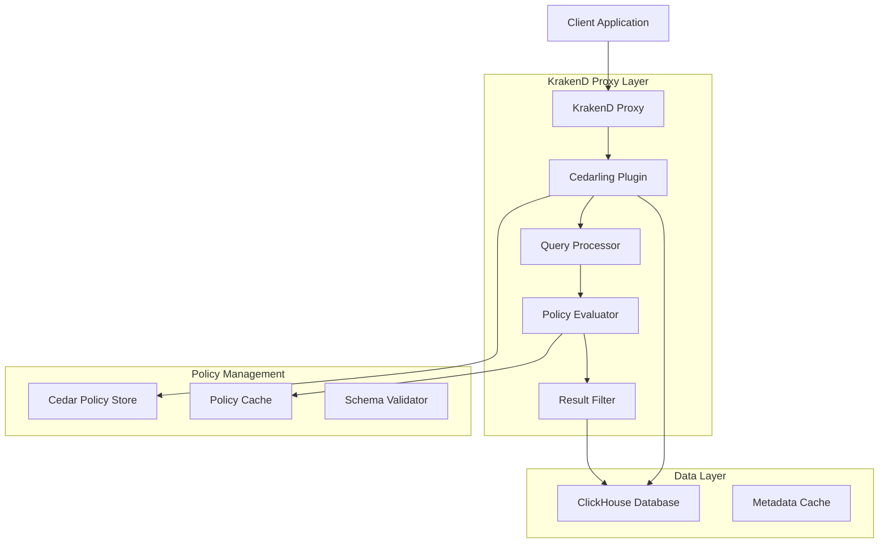

# Design Document

## Overview

The LockHouse system implements document-level security for ClickHouse databases through a KrakenD proxy integrated with Cedarling policy evaluation. The solution acts as a transparent proxy that executes client queries against ClickHouse without modification, then applies row-level security by evaluating Cedar policies against each individual result row.

When a client submits a query, the proxy extracts user identity and context from JWT tokens, forwards the original query to ClickHouse unchanged, and receives the complete result set. Each row in the results is then individually evaluated against applicable Cedar policies using the user's context and the row's data attributes. Only rows that pass policy evaluation are included in the final response returned to the client.

This result-filtering approach ensures that users can only access data they are authorized to view while maintaining the full expressiveness of Cedar policies without the complexity of translating policy logic into SQL constraints.

## Architecture

### High-Level Architecture



### Component Interaction Flow

1. **Request Reception**: KrakenD receives SQL query with JWT authentication
2. **Identity Extraction**: Cedarling plugin extracts user context from JWT token
3. **Query Execution**: Original query executes against ClickHouse without modification
4. **Result Processing**: Each result row is processed for policy evaluation
5. **Policy Evaluation**: Cedar policies are evaluated against user context and row data
6. **Result Filtering**: Rows that fail policy evaluation are removed from results
7. **Response Assembly**: Filtered results are assembled into final response
8. **Audit Logging**: Access decisions and filtering actions are logged

## Components and Interfaces

### KrakenD Cedarling Plugin

**Purpose**: Main orchestration component that integrates Cedarling policy evaluation with KrakenD proxy functionality.

**Key Responsibilities**:
- JWT token validation and user context extraction
- SQL query execution against ClickHouse
- Result row processing and policy evaluation
- Result filtering based on policy decisions
- Audit logging and performance monitoring

**Interfaces**:
```go
type CedarlingPlugin interface {
    ProcessRequest(ctx context.Context, req *ProxyRequest) (*ProxyResponse, error)
    ValidateToken(token string) (*UserContext, error)
    ExecuteQuery(query string) (*QueryResult, error)
    FilterResults(ctx *UserContext, results *QueryResult) (*FilteredResult, error)
}

type UserContext struct {
    Subject     string            `json:"sub"`
    Issuer      string            `json:"iss"`
    Audience    string            `json:"aud"`
    Scopes      []string          `json:"scopes"`
    Attributes  map[string]any    `json:"attributes"`
    Expiration  time.Time         `json:"exp"`
}
```

### Result Processor

**Purpose**: Processes query results and filters rows based on policy evaluation.

**Key Responsibilities**:
- Result row parsing and data extraction
- Row-level policy evaluation coordination
- Result filtering based on policy decisions
- Performance optimization for large result sets
- Support for various ClickHouse data types

**Interfaces**:
```go
type ResultProcessor interface {
    ProcessResults(results *QueryResult, userCtx *UserContext) (*FilteredResult, error)
    EvaluateRowAccess(row *ResultRow, userCtx *UserContext) (*AccessDecision, error)
    BuildRowContext(row *ResultRow, tableMetadata *TableMetadata) (*RowContext, error)
    FilterResultSet(results *QueryResult, decisions []*AccessDecision) (*FilteredResult, error)
}

type QueryResult struct {
    Columns     []ColumnInfo      `json:"columns"`
    Rows        []*ResultRow      `json:"rows"`
    Metadata    *QueryMetadata    `json:"metadata"`
    ExecutionTime time.Duration   `json:"execution_time"`
}

type ResultRow struct {
    Values      []interface{}     `json:"values"`
    ColumnMap   map[string]int    `json:"column_map"`
    TableName   string            `json:"table_name"`
    RowIndex    int               `json:"row_index"`
}
```

### Policy Evaluator

**Purpose**: Evaluates Cedar policies against user context and query metadata to determine access permissions.

**Key Responsibilities**:
- Cedar policy engine integration
- Policy decision caching
- Context building for policy evaluation
- Multi-policy aggregation and conflict resolution
- Performance optimization through caching

**Interfaces**:
```go
type PolicyEvaluator interface {
    EvaluateAccess(ctx *UserContext, resource *ResourceContext) (*PolicyDecision, error)
    BuildPolicyContext(user *UserContext, resource *ResourceContext) (*CedarContext, error)
    CacheDecision(key string, decision *PolicyDecision, ttl time.Duration) error
    GetCachedDecision(key string) (*PolicyDecision, bool)
}

type PolicyDecision struct {
    Decision    DecisionType        `json:"decision"`
    Constraints []SecurityConstraint `json:"constraints"`
    Policies    []string            `json:"applied_policies"`
    Reason      string              `json:"reason"`
    Metadata    map[string]any      `json:"metadata"`
}

type CedarContext struct {
    Principal   CedarEntity         `json:"principal"`
    Action      CedarAction         `json:"action"`
    Resource    CedarResource       `json:"resource"`
    Context     map[string]any      `json:"context"`
}
```

### Policy Store Integration

**Purpose**: Manages Cedar policies and schemas with integration to Cedarling policy store.

**Key Responsibilities**:
- Policy storage and retrieval
- Schema validation
- Policy versioning and updates
- Hot reloading of policy changes
- Policy conflict detection

**Interfaces**:
```go
type PolicyStore interface {
    GetPolicies(table string) ([]CedarPolicy, error)
    ValidatePolicy(policy *CedarPolicy) error
    UpdatePolicy(id string, policy *CedarPolicy) error
    DeletePolicy(id string) error
    GetSchema() (*CedarSchema, error)
    WatchPolicyChanges() (<-chan PolicyChangeEvent, error)
}

type CedarPolicy struct {
    ID          string            `json:"id"`
    Name        string            `json:"name"`
    Policy      string            `json:"policy"`
    Tables      []string          `json:"tables"`
    Actions     []string          `json:"actions"`
    Version     int               `json:"version"`
    Metadata    map[string]any    `json:"metadata"`
}
```

### Audit Logger

**Purpose**: Provides comprehensive logging and monitoring of access decisions and system performance.

**Key Responsibilities**:
- Access decision logging
- Performance metrics collection
- Security event monitoring
- Compliance reporting
- Error tracking and alerting

**Interfaces**:
```go
type AuditLogger interface {
    LogAccessDecision(ctx *UserContext, decision *PolicyDecision, query string) error
    LogPerformanceMetrics(operation string, duration time.Duration, metadata map[string]any) error
    LogSecurityEvent(event *SecurityEvent) error
    GenerateComplianceReport(period time.Duration) (*ComplianceReport, error)
}

type SecurityEvent struct {
    Type        EventType         `json:"type"`
    Timestamp   time.Time         `json:"timestamp"`
    User        string            `json:"user"`
    Resource    string            `json:"resource"`
    Action      string            `json:"action"`
    Decision    DecisionType      `json:"decision"`
    Reason      string            `json:"reason"`
    Metadata    map[string]any    `json:"metadata"`
}
```

## Data Models

### Cedar Schema for ClickHouse Document Security

```cedar
// Entity types for ClickHouse document-level security
entity User = {
  "id": String,
  "email": String,
  "department": String,
  "role": String,
  "organization": String,
  "security_clearance": String,
  "attributes": Set<String>,
};

entity ClickHouseTable = {
  "database": String,
  "table": String,
  "classification": String,
  "owner": String,
  "created_at": String,
  "metadata": Set<String>,
};

entity Document = {
  "table": String,
  "row_id": String,
  "owner": String,
  "department": String,
  "classification": String,
  "tags": Set<String>,
  "created_at": String,
  "updated_at": String,
};

// Actions for database operations
action Select, Insert, Update, Delete, Truncate;

// Context for policy evaluation
entity QueryContext = {
  "user_ip": String,
  "timestamp": String,
  "query_type": String,
  "affected_tables": Set<String>,
  "jwt_claims": Set<String>,
};

namespace ClickHouseLock {
  common SecurityLevel = {
    "public": Long,
    "internal": Long,
    "confidential": Long,
    "restricted": Long,
  };
}
```

### Configuration Schema

```json
{
  "clickhouse_lock": {
    "clickhouse": {
      "host": "localhost",
      "port": 9000,
      "database": "default",
      "username": "default",
      "password": "",
      "connection_pool_size": 10,
      "query_timeout": "30s"
    },
    "cedarling": {
      "policy_store_url": "https://policy-store.example.com",
      "policy_refresh_interval": "5m",
      "cache_ttl": "1h",
      "cache_size": 1000
    },
    "security": {
      "jwt_validation": {
        "issuer": "https://auth.example.com",
        "audience": "clickhouse-api",
        "jwks_url": "https://auth.example.com/.well-known/jwks.json"
      },
      "default_deny": true,
      "audit_logging": true,
      "performance_monitoring": true
    },
    "query_processing": {
      "max_query_size": "1MB",
      "allowed_operations": ["SELECT", "INSERT", "UPDATE", "DELETE"],
      "blocked_functions": ["system", "file", "url"],
      "query_timeout": "30s"
    }
  }
}
```

## Error Handling

### Error Categories

1. **Authentication Errors**
   - Invalid JWT token
   - Expired token
   - Missing required claims
   - Token signature validation failure

2. **Authorization Errors**
   - Policy evaluation failure
   - Access denied by policy
   - Insufficient permissions
   - Resource not found

3. **Query Processing Errors**
   - SQL parsing failure
   - Unsupported query type
   - Query transformation error
   - ClickHouse execution error

4. **System Errors**
   - Policy store unavailable
   - ClickHouse connection failure
   - Cache service error
   - Configuration error

### Error Response Format

```json
{
  "error": {
    "code": "AUTHORIZATION_DENIED",
    "message": "Access denied to table 'sensitive_data'",
    "details": {
      "policy_id": "policy_123",
      "reason": "User lacks required security clearance",
      "user_id": "user_456",
      "resource": "database.sensitive_data",
      "timestamp": "2025-01-08T10:30:00Z"
    },
    "request_id": "req_789"
  }
}
```

### Fallback Strategies

1. **Policy Store Unavailable**: Use cached policies with configurable staleness tolerance
2. **ClickHouse Unavailable**: Return service unavailable with retry-after header
3. **Cache Failure**: Fall back to direct policy evaluation with performance impact
4. **Query Parsing Failure**: Reject query with detailed syntax error information

## Testing Strategy

### Unit Testing

1. **Query Processor Tests**
   - SQL parsing accuracy
   - Security constraint injection
   - Query optimization validation
   - Edge case handling

2. **Policy Evaluator Tests**
   - Cedar policy evaluation correctness
   - Caching behavior validation
   - Performance benchmarking
   - Error condition handling

3. **Authentication Tests**
   - JWT validation scenarios
   - Token expiration handling
   - Claim extraction accuracy
   - Security vulnerability testing

### Integration Testing

1. **End-to-End Query Flow**
   - Complete request-response cycle
   - Multi-table query scenarios
   - Complex policy evaluation
   - Performance under load

2. **Policy Store Integration**
   - Policy CRUD operations
   - Hot reloading functionality
   - Schema validation
   - Conflict resolution

3. **ClickHouse Integration**
   - Query execution accuracy
   - Connection pool management
   - Error propagation
   - Transaction handling

### Security Testing

1. **SQL Injection Prevention**
   - Parameterized query validation
   - Input sanitization testing
   - Bypass attempt detection
   - Error message security

2. **Authorization Bypass Testing**
   - Policy circumvention attempts
   - Token manipulation testing
   - Privilege escalation detection
   - Access control validation

3. **Performance Security**
   - DoS attack resilience
   - Resource exhaustion testing
   - Cache poisoning prevention
   - Rate limiting validation

### Performance Testing

1. **Latency Benchmarks**
   - Policy evaluation overhead
   - Query transformation time
   - Cache hit/miss ratios
   - End-to-end response time

2. **Throughput Testing**
   - Concurrent request handling
   - Connection pool efficiency
   - Memory usage optimization
   - CPU utilization monitoring

3. **Scalability Testing**
   - Large policy set performance
   - High user concurrency
   - Database size impact
   - Horizontal scaling validation